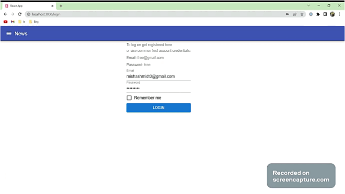
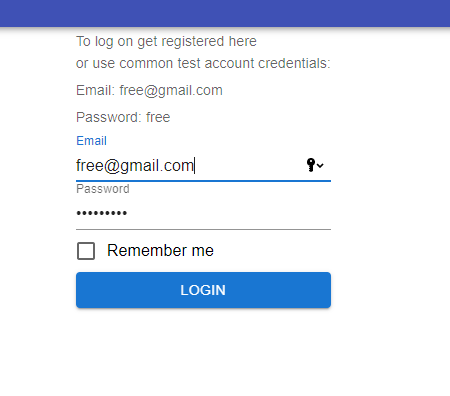

# App Todolist

[Demo todolist](https://todolist-seven-rho.vercel.app)

The Todolist app allows you to record tasks, mark them as completed, and sort them.
This application works directly with databases

Also included are tests.

### Login

### Technology stack

1. TS
2. React
3. Redux
4. Jest
5. MIU
6. axios
7. formik

### Install app

`git clone https://github.com/mishashmidt0/todolist2.0.git`

`npm install` or `yarn`

